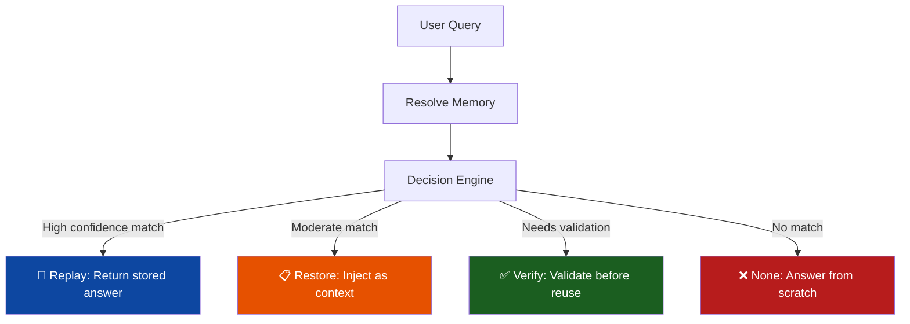
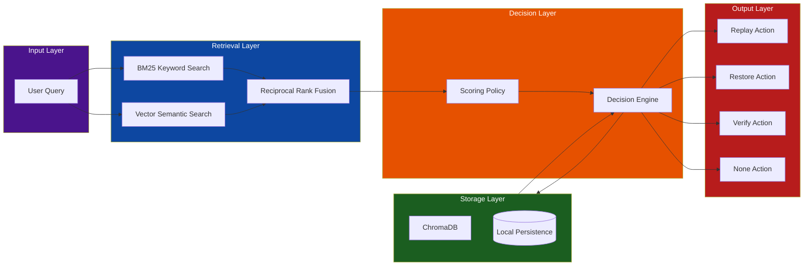
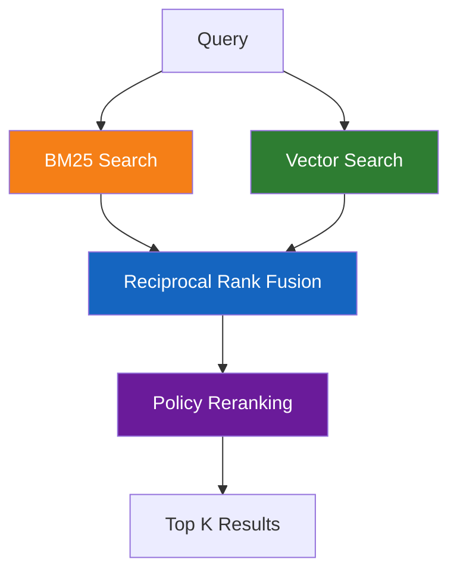

# Agent Memory

[](https://github.com/TheProdSDE/agent-memory/actions)
[](https://www.python.org/downloads/)
[](https://opensource.org/licenses/MIT)
[](https://pypi.org/project/agent-memory-sdk/)

**Persistent semantic memory for AI agents with intelligent decision-making.**

> **🚀 Created by:** [TheProdSDE](https://github.com/TheProdSDE)

---

## 🎯 The Problem

Most AI memory systems simply retrieve and inject past context into every prompt. This leads to:
- **💰 Higher token costs** - Unnecessary context in every query
- **🎭 Inconsistent responses** - No validation of stale or incorrect memories
- **⏱️ Poor performance** - Always processing memory, even when irrelevant
- **🤖 No intelligence** - Memory is treated as a dumb cache

## ✨ The Solution

Agent Memory is a **decision layer** that intelligently chooses when and how to use memory:



**Benefits:**
- ✅ **Response consistency** - Reuse proven answers
- ✅ **Lower token usage** - Only inject when beneficial
- ✅ **Faster responses** - Instant replay for repeated queries
- ✅ **Better long-term behavior** - Agents learn when to trust memory

---

## 🏗️ Architecture



### How It Works

1. **Query Input**: User query enters the system
2. **Hybrid Retrieval**: BM25 (keyword) + Vector (semantic) search with RRF fusion
3. **Policy Scoring**: Multi-factor scoring (semantic + recency + confidence + usage)
4. **Decision Engine**: Intelligently selects the best action
5. **Action Execution**: Returns appropriate response based on decision

---

## 📦 Features

### 🎯 Decision-Based Memory

Memory is **not automatically injected**. Each query results in one of four actions:

| Action | Behavior | Use Case |
|--------|----------|----------|
| **Replay** | Return previous answer | Exact or near-identical queries |
| **Restore** | Inject memory as context | Similar queries needing adaptation |
| **Verify** | Validate before reuse | Facts, workflows, tool outputs |
| **None** | Ignore memory | Unrelated queries |

### 🔍 Hybrid Retrieval Pipeline



**Policy scoring considers:**
- 📊 Semantic similarity (70% weight)
- 📅 Recency (15% weight)
- ✅ Confidence score (20% weight)
- 🔄 Usage frequency (10% weight)

### 🗃️ Structured Memory

Store memories with **type** and **scope** for better organization:

**Memory Types:**
- `conversation` - Chat history
- `fact` - Verifiable information
- `workflow` - Step-by-step processes
- `document` - Long-form content
- `tool_output` - API/tool responses
- `code` - Code snippets
- `summary` - Consolidated memories
- `preference` - User preferences

**Scopes:**
- `session` - Current conversation
- `user` - User-specific
- `project` - Project-specific
- `workspace` - Workspace-wide
- `team` - Team-shared
- `global` - Application-wide

### ⏰ Time-to-Live (TTL)

Automatic expiration with flexible TTL:
```python
# Absolute time
memory.remember(query, response, ttl="30d")  # 30 days
memory.remember(query, response, ttl="2h")   # 2 hours

# Relative time
memory.remember(query, response, ttl=3600)   # 1 hour in seconds
```

### 📊 Observability

Full transparency into decision-making:
```python
decision = memory.resolve(query)
print(decision)  # Decision object
print(decision.explain())  # Detailed score breakdown
```

---

## 🚀 Quick Start

### Installation

```bash
# From PyPI
pip install agent-memory-sdk

# From source (development)
git clone https://github.com/TheProdSDE/agent-memory.git
cd agent-memory
pip install -e ".[dev]"
```

### Basic Usage

```python
from agent_memory import Memory, MemoryAction, MemoryType

# Initialize memory
memory = Memory(persist_dir=".agent_memory")

# Store a memory
memory.remember(
    query="How do I reset my password?",
    response="Go to Settings → Security → Reset Password and follow the email link.",
    type=MemoryType.CONVERSATION,
    tags=["auth", "faq"],
    confidence=0.95
)

# Store a fact that requires verification
memory.remember(
    query="Current API rate limit",
    response="1000 requests/minute per API key.",
    type=MemoryType.FACT,
    requires_verification=True
)

# Resolve a query
decision = memory.resolve("How do I reset my password?")

# Handle the decision
match decision.action:
    case MemoryAction.REPLAY:
        print(f"Replaying: {decision.response}")
    case MemoryAction.RESTORE:
        context = memory.format_restore_context(decision)
        print(f"Context: {context}")
        # Use with your LLM: llm(query, context=context)
    case MemoryAction.VERIFY:
        print(f"Verify: {decision.memory.response}")
        # Validate with tools before reuse
    case MemoryAction.NONE:
        print("No relevant memory - answer from scratch")
```

---

## 🛠️ API Reference

### Core Methods

```python
# Memory management
memory.remember(query, response, *, type, scope, tags, confidence, ttl, metadata)
memory.get(memory_id)
memory.list(limit=100, offset=0, *, scope, include_archived, type)
memory.forget(memory_id)
memory.archive(memory_id)

# Query and resolve
decision = memory.resolve(query, *, mode, top_k, scope, enable_verify)

# Maintenance
memory.cleanup(delete=False)  # Mark expired as expired
memory.cleanup(delete=True)   # Delete expired
memory.consolidate(similarity_threshold=0.95)  # Merge duplicates
memory.stats()  # Get usage statistics
```

### Decision Object

```python
class MemoryDecision:
    action: MemoryAction  # REPLAY, RESTORE, VERIFY, NONE
    confidence: float     # 0.0 - 1.0
    query: str            # Original query
    reason: str           # Human-readable reason
    reasons: list[str]    # Detailed reasons
    response: str | None  # For REPLAY action
    memory: MemoryEntry | None  # For REPLAY/VERIFY
    context: list[RetrievalResult]  # For RESTORE/VERIFY
    
    def explain(self) -> str:  # Detailed score breakdown
        return "..."
```

---

## 🔌 MCP Server Integration

Expose Agent Memory as MCP tools for Cursor, VS Code, and other MCP-compatible agents.

### Configuration for Cursor

Add to `~/.cursor/mcp.json`:

```json
{
  "mcpServers": {
    "agent-memory": {
      "command": "agent-memory-mcp",
      "env": {
        "AGENT_MEMORY_DIR": "~/.agent_memory"
      }
    }
  }
}
```

### Available MCP Tools

| Tool | Description |
|------|-------------|
| `remember_memory` | Store a query/response pair |
| `resolve_memory` | Retrieve and decide action |
| `list_memories` | List with pagination |
| `get_memory` | Fetch single memory |
| `forget_memory` | Delete memory |
| `archive_memory` | Archive memory |
| `consolidate_memories` | Merge duplicates |

### Docker-based MCP (Recommended)

```json
{
  "mcpServers": {
    "agent-memory": {
      "command": "docker",
      "args": [
        "run", "--rm", "-i",
        "-v", "agent_memory_data:/home/appuser/.agent_memory",
        "ghcr.io/theprodsde/agent-memory:latest",
        "agent-memory-mcp"
      ]
    }
  }
}
```

---

## 📊 CLI Reference

```bash
# Show help
agent-memory --help

# Store a memory
agent-memory remember "query" "response" \
  --type conversation \
  --scope user \
  --ttl 30d

# Resolve a query
agent-memory resolve "query" --explain

# Show statistics
agent-memory stats

# Cleanup expired memories
agent-memory cleanup --delete

# Run benchmark
agent-memory benchmark --seed --repeat 3

# Run evaluation
agent-memory eval --datasets ./benchmarks/datasets
```

---

## 🏃 Benchmark & Evaluation

### Benchmark

```bash
# Quick benchmark with default queries
agent-memory benchmark

# With seeded data from eval datasets
agent-memory benchmark --seed --repeat 3

# Custom baseline comparison
agent-memory benchmark --baseline-ms 500
```

### Evaluation

```bash
# Run all datasets
agent-memory eval

# Specific dataset directory
agent-memory eval --datasets ./benchmarks/datasets
```

**Included Datasets:**
- `coding_agent.json` - Code-related queries
- `customer_support.json` - Support scenarios
- `research_agent.json` - Research workflows

---

## � Release Process

### How Releases Work

The project uses **automated CI/CD** via GitHub Actions. Releases are triggered by **pushing a version tag**:

```bash
# Create and push a version tag (triggers full release pipeline)
git tag v0.1.3
git push origin v0.1.3
```

### What Happens on Tag Push

When you push a tag matching `v*` (e.g., `v0.1.3`, `v1.0.0`, `v2.0.0-beta.1`):

| Step | Description |
|------|-------------|
| 1️⃣ **Test** | Runs tests on Python 3.10, 3.11, 3.12, 3.13 |
| 2️⃣ **Benchmark** | Runs performance benchmarks |
| 3️⃣ **Docker** | Builds and tests multi-stage Docker image |
| 4️⃣ **Publish** | Builds package → Publishes to PyPI → Creates GitHub Release |

### Release Artifacts Created

| Artifact | Location |
|----------|----------|
| **PyPI Package** | `pip install agent-memory-sdk==0.1.3` |
| **GitHub Release** | https://github.com/theprodsde/agent-memory/releases/tag/v0.1.3 |
| **Docker Image** | `ghcr.io/theprodsde/agent-memory:v0.1.3` (if configured) |
| **Source Archives** | Auto-attached to GitHub Release |

### Version Format

Use **Semantic Versioning** with optional pre-release suffixes:
- `v1.0.0` - Stable release
- `v1.0.1` - Patch release
- `v1.1.0` - Minor release
- `v2.0.0` - Major release
- `v1.0.0-alpha.1` - Alpha pre-release
- `v1.0.0-beta.2` - Beta pre-release
- `v1.0.0-rc.1` - Release candidate

### Prerequisites

1. **PyPI Token** - Stored as `PYPI_API_TOKEN` in GitHub repository secrets
2. **GitHub Token** - Automatically provided as `GITHUB_TOKEN`
3. **Branch Protection** - Recommended: require PR reviews before merging to main

### Manual Release (if needed)

```bash
# 1. Ensure you're on main with latest changes
git checkout main
git pull origin main

# 2. Create version tag
git tag v0.1.3

# 3. Push tag (triggers CI/CD)
git push origin v0.1.3

# 4. Monitor workflow
# https://github.com/theprodsde/agent-memory/actions
```

### Rollback / Delete Release

```bash
# Delete local tag
git tag -d v0.1.3

# Delete remote tag (also deletes GitHub Release)
git push origin --delete v0.1.3

# Note: PyPI packages CANNOT be deleted, only yanked
# twine yank agent-memory-sdk 0.1.3
```

---

## 📈 Current Status (v0.1.2)

### ✅ Implemented
- Hybrid retrieval (BM25 + Vector + RRF fusion)
- Decision engine (replay / restore / verify / none)
- `decision.explain()` observability
- Benchmark & evaluation datasets
- TTL + memory states + cleanup
- CLI (remember, resolve, stats, benchmark, eval)
- MCP support for Cursor and other clients
- Comprehensive documentation
- All tests passing
- CI/CD pipeline
- Docker support

### 🚧 Roadmap

| Feature | Status | ETA |
|---------|--------|-----|
| Async API | ✅ Completed | v0.1.0-alpha |
| SQLite backend | ✅ Completed | v0.1.0-alpha |
| Redis backend | 📋 Planned | v0.2.0 |
| Postgres backend | 📋 Planned | v0.3.0 |
| FastAPI server + dashboard | 📋 Planned | v0.3.0 |
| Memory graph | 📋 Planned | v0.4.0 |
| Confidence learning | 📋 Planned | v0.4.0 |
| Multi-agent support | 📋 Planned | v0.5.0 |

---

## 🛡️ Tech Stack

| Component | Technology |
|-----------|------------|
| **Language** | Python 3.10+ |
| **Storage** | ChromaDB (local embeddings) |
| **Retrieval** | BM25 + Vector Search + RRF |
| **Interface** | MCP (Model Context Protocol) |
| **CLI** | argparse |
| **Testing** | pytest + pytest-asyncio |
| **Linting** | ruff |
| **Type Checking** | mypy |
| **CI/CD** | GitHub Actions |
| **Container** | Docker + docker-compose |

**No API keys required** - Everything runs locally!

---

## 📚 Documentation

- **[Getting Started](docs/getting-started.md)** - Installation and basic usage
- **[Architecture](docs/architecture.md)** - Deep dive into the system design
- **[Memory Model](docs/memory-model.md)** - Understanding memory types and states
- **[Policies](docs/policies.md)** - Customizing scoring and decision logic
- **[Benchmarks](docs/benchmarks.md)** - Performance metrics and evaluation
- **[FAQ](docs/faq.md)** - Common questions and troubleshooting

---

## 🤝 Contributing

Contributions are welcome! Please follow these steps:

1. Fork the repository
2. Create a feature branch (`git checkout -b feature/amazing-feature`)
3. Make your changes
4. Run tests (`python -m pytest tests/`)
5. Run linting (`ruff check agent_memory/ tests/`)
6. Commit your changes (`git commit -m 'Add amazing feature'`)
7. Push to the branch (`git push origin feature/amazing-feature`)
8. Open a Pull Request

### Development Setup

```bash
# Clone the repository
git clone https://github.com/TheProdSDE/agent-memory.git
cd agent-memory

# Create virtual environment
python -m venv .venv
source .venv/bin/activate  # or .venv\Scripts\activate on Windows

# Install in development mode
pip install -e ".[dev]"

# Install pre-commit hooks
pip install pre-commit
pre-commit install

# Run tests
make test

# Run all checks
make check
```

---

## 📜 License

This project is licensed under the **MIT License** - see the [LICENSE](LICENSE) file for details.

---

## 🙏 Acknowledgments

- **[ChromaDB](https://github.com/chroma-core/chroma)** - Vector database
- **[Rank-BM25](https://github.com/dorianbrown/rank_bm25)** - BM25 implementation
- **[MCP](https://github.com/modelcontextprotocol/python-sdk)** - Model Context Protocol
- **[FastMCP](https://github.com/modelcontextprotocol/fastmcp)** - MCP server framework

---

## 📞 Support

- **Issues**: [GitHub Issues](https://github.com/TheProdSDE/agent-memory/issues)
- **Discussions**: [GitHub Discussions](https://github.com/TheProdSDE/agent-memory/discussions)
- **Email**: theprodsde@gmail.com

---

> **Agent Memory helps agents decide:**
> **Replay → Restore → Verify → Ignore**

> **Built with ❤️ by [TheProdSDE](https://github.com/TheProdSDE)**